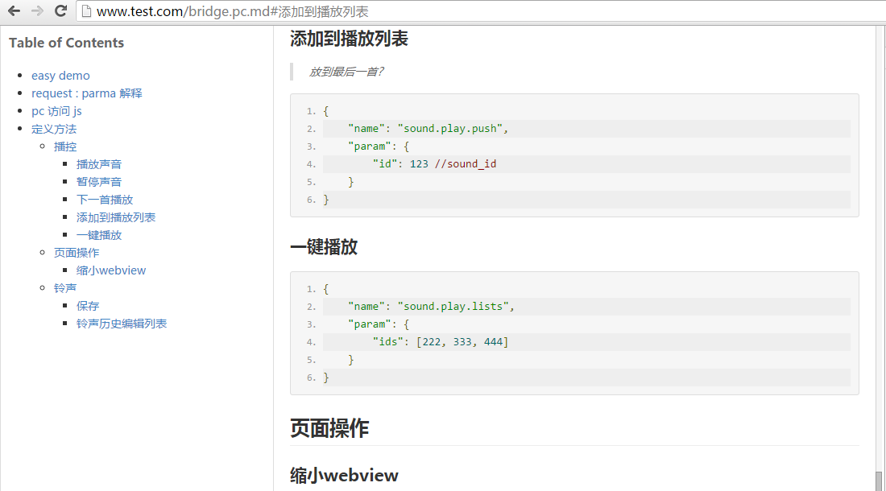
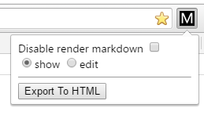

# chrome-ext-markdown
**chrome-ext-markdown** : chrome插件,可以将.md markdown 语法渲染为html

# 安装
- 打开 `chrome://extensions/`
- 在 `https://github.com/zx5435/chrome-ext-markdown/releases` 下载 已打包的 `Source code (zip)` 或 `Source code (tar.gz)`
- 将 `chrome-ext-markdown.crx` 拖拽到 `chrome://extensions/`
- 打开 `https://raw.githubusercontent.com/zx5435/chrome-ext-markdown/master/README.md` 查看

# 效果

# 设置

### Disable render markdown
关闭解析功能

### show & edit
- [x] show : 左侧为导航区,右侧html显示
- [ ] edit : 左侧为编辑区,右侧html显示

# 依赖
https://github.com/pandao/editor.md

# License
QQ 825407762